<html>
<body>

# **Takım & Proje İsmi**

### **`Corprate`**

# Takım ve Ürün Hakkındaki Bilgiler

  ## Takım Üyeleri

  <table>
    <tr>
      <th></th>
      <th>İsim</th>
      <th>Görev</th>
    </tr>
    <tr>
      <td></td>
      <td>Mustafa İsmail Öztürk</td>
      <td>Scrum Master</td>
    </tr>
    <tr>
      <td></td>
      <td>İrem Atlı</td>
      <td>Product Owner</td>
    </tr>
    <tr>
      <td></td>
      <td>Muhammet Ünveren</td>
      <td>Pasif Üye</td>
    </tr>
    <tr>
      <td></td>
      <td>Nazım Çimen</td>
      <td>Developer</td>
    </tr>
    <tr>
      <td></td>
      <td>İlayda Kaptanoğlu</td>
      <td>Designer</td>
    </tr>
  
  </table>

  
  
  
  
  
  
  
  ## Ürün Açıklaması
  Kuruluşların Gerçek Değerini Keşfedin! Corprate, şirketler, okullar ve vakıflar gibi pek çok kuruluşu anonim bir şekilde en ince ayrıntılarına kadar değerlendirebileceğiniz kapsamlı bir mobil anket uygulamasıdır. İş dünyasından, eğitim sektörüne ve sivil toplum kuruluşlarına kadar pek çok kurumun imkanlarıyla alakalı gerçeği öğrenmek ve paylaşmak için ihtiyacınız olan her şeyi tek bir uygulamada sunar. Corprate rakiplerine kıyasla benzersiz bir uygulamadır. Kullanıcıların günlük yalnızca 5 dakika ayırmalarını sağlayarak bağlı oldukları kuruluşlardaki güncel durumlara dair mini anketler doldurmalarını sağlar. Big data veriler anonim olarak her gün uygulamada paylaşılır ve size de kurumda şeffaklığın tadını çıkarmak kalır.

  

    
<h2>Ürün Özellikleri</h2>

  <h3>Güncel Veriler:</h3>
    
Corprate kullanıcıların çalıştıkları veya etkileşimde bulundukları şirketleri, okulları ve vakıfları gerçek zamanlı olarak değerlendirmelerini sağlar. Bu değerlendirmeler, kullanıcı deneyimlerini ve memnuniyetini objektif bir şekilde yansıtır.

  <h2>Mini Anketler:</h2>
    
Corprate kurum içindeki imkanlarla ilgili doğrulanmış çalışanlara düzenli olarak mini anketler sunar. Bu anketler sayesinde, kuruluşların performansını ve çalışan memnuniyetini belirleyen veriler toplanır ve kuruluş puanları oluşturulur.

  <h2>Anonim Paylaşımlar:</h2>
    
 Anket verileri Big Data olarak toplanır. Kullanıcılar, yaşadıkları deneyimleri ve karşılaştıkları sorunları anonim olarak diğer kullanıcılarla paylaşabilir. Bu sayede, gerçek ve tarafsız geri bildirimler topluluk içinde yayılır.

  <h2>Topluluk ve Etkileşim:</h2>
    
Corprate sayesinde diğer kullanıcıların kurumlarla alakalı yorumlarını ve değerlendirmelerini inceleyerek kapsamlı bilgi sahibi olun. Uygulama içi düzenlenen etkinlikler ve webinarlarla topluluğun bir parçası olun. 

  <h2>Kullanıcı Dostu Arayüz:</h2>
    
Corprate kullanıcılara basit ve sade bir uygulama arayüzü sunar. Bu sayede size yalnızca verilere odaklanmak kalır.

  <h2>Kullanıcı Desteği:</h2>
    
Corprate kullanıcılara yaşadıkları olumlu ve olumsuz her uygulama deneyimi için kesintisiz destek sunar.

  <h2>Detaylı Araştırmalar:</h2>
    
Corprate şirket tuvalatlerinin temizliğinden, klimaların çalışıp çalışmadığına ve yöneticilerin tavırlarına kadar pek çok detaylı veriyi güncel ve şeffaf bir şekide sunar.

  <h2>Veri Kategorizasyonu:</h2>
    
Corprate verilerin nereden sağlandığı ve güvenilirlik derecesine kadar pek çok değişkeni kullanıcılara sunar.

  <h2>Favori Kuruluşlar:</h2>
    
Corprate kuruluşları takip etmenizi sağlar. Bu sayede ana sayfanızda ve bildirim kutunuzda takip ettiğiniz kuruluşlarla alakalı hızlı veriyi elde edersiniz.

  <h2>Dil ve Ülke Desteği:</h2>
    
Corprate'in gelecek hedefi dünyanın bütün ülkelerinde geniş bir anket ağı kurulmasını sağlamaktır. Bu sayede nereye giderseniz gidin güncel ve şeffaf veriye kolayca ulaşırsınız.

  

  

    
<h2>Hedef Kitle</h2>

    
Corprate temelde Y ve Z kuşaklarını hedef almaktadır. İş ve okul hayatında zorluklar yaşayan ve haksızlığa uğrayan kişilerin seslerini duyurabilecekleri bir platform oluşturmak Corprate'in birincil hedefidir. Bu kişiler sorunlarını paylaştıklarında bulundukları kurumu zedeleyeceklerini ve tespit edildiklerinde bu durumun kendilerine negatif şekilde yansıyacağını düşünmektedir. Corprate bu kişilerin anonim olarak herhangi bir yaptırıma maruz kalmadan kendilerini ifade edebilemelerini sağlar.
    Bir başka hedef kitlemiz ise iş ve okul arayanlardır. Bu kişiler geleneksel medyada kurumların durumuyla alakalı detaylı bilgiler öğrenmeye çalışırlar ama her seferinde yanıltıcı bilgilerin kurbanı olurlar. Corparate bu kullanıcılara tarafsız ve güvenilir veriyi sunar

  

  --- 

  

  

    
<h1>Sprint 1</h1>

  

    
<h3>Sprint 1 - App Screenshots</h3>

  <table style="width: 100%;">
    <tr>
      <td colspan="4" style="text-align: center;"><h2>Profil Sayfası</h2></td>
    </tr>
    <tr>
      <td style="width: 25%;"></td>
    </tr>
    <tr>
      <td colspan="4" style="text-align: center;"><h2>Takip Et Sayfası</h2></td>
    </tr>
    <tr>
      <td style="width: 25%;"></td>
    </tr>
  </table>
  
   

  

    
<h3>Sprint 1 - Sprint 1 Jira Screenshots</h3>

    
    
  

  

    
<h3>Sprint 1 - Sprint 1 Figma Screenshots</h3>

    
    
  

  

    
<h3>Sprint 1 - Burndown Chart</h3>

    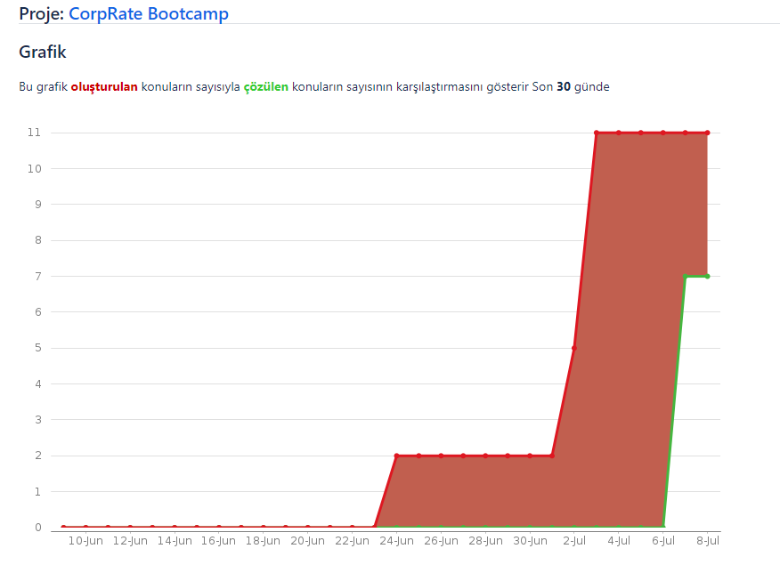
  

**Sprint Notları**:

    - Daily Scrum toplantılarını yapmak için 'Discord' tercih edildi.
    
    - Veri görselleştirilmesi için 'PieChart' paketi tercih edildi.

    - Proje yönetimi için 'Jira' programı tercih edildi.

    - UI dizaynı için 'Figma' programı tercih edildi.

    - Uygulama mimarisi için 'MVVM' tercih edildi.

    - Uygulama veri tabanı için 'Firebase' tercih edildi.
    
    - Yönlendirme sistemi için 'Getx' tercih edildi.

    - Firebase'in Sunduğu Email üzerinde kayıt sistemi tercih edildi.
    
  - **Sprint için Belirlenen Toplam Puan**: 120 puan
  - **Tamamlanan Puan**: `(120 puan tamamlandı)`
  
  - **Sprint Review:**
    - Birinci Sprint için ağırlıklı olarak UI üzerine çalıştık.
    - Kulanacağımız teknolojileri belirledik.
    - Yeteneklerimize göre kod yazma ve tasarım kısımlarının kimde olması gerektiğine karar verdik.
    - Sprint için 8 görev belirledik ve yaşanan tüm aksaklıklara rağmen başarılı şekilde tüm görevleri tamamladık.
    - Projemizin hedef kitlesini ve çalışma mantığını net şekilde belirledik.
  
  - **Sprint Retrospective:**
    - İkinci Sprint için daha planlı ve iletişim halinde çalışmamız gerekiyor.
    - Görevlerin tanımları Jira üzerinde daha net açıklanabilirdi.
    - Daily Scrum toplantıları ekibin iş yoğunluklarına göre daha esnek düzenlenmeli
    - Kod yazamayanların iş yükünü takım içinde daha dengeli paylaştırmalıyız.
 

  ---

  

    
<h1>Sprint 2</h1>

  

    
<h3>Sprint 2 - App Screenshots</h3>

  <table style="width: 100%;">
    <tr>
      <td colspan="1" style="width: 25%;">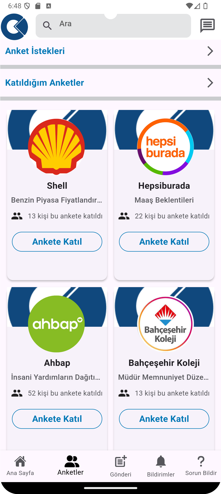</td>
    </tr>
    <tr>
      <td colspan="4">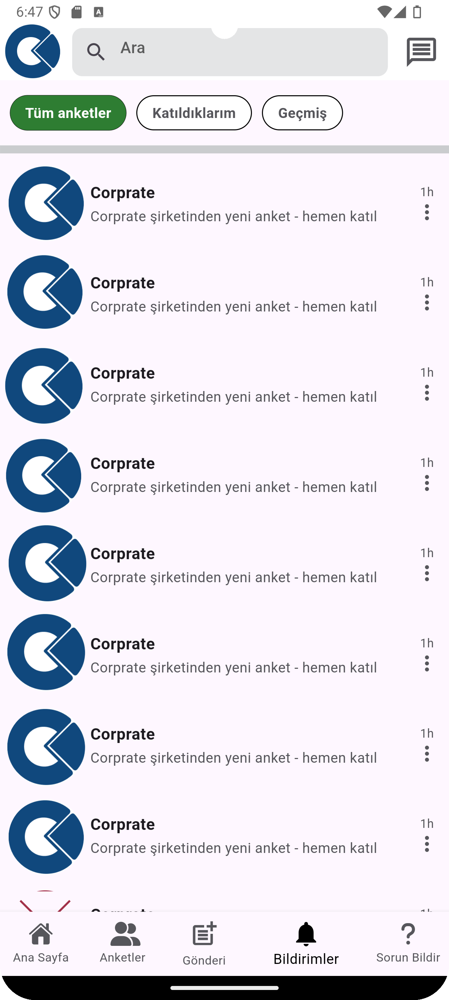</td>
    </tr>
    <tr>
      <td colspan="4">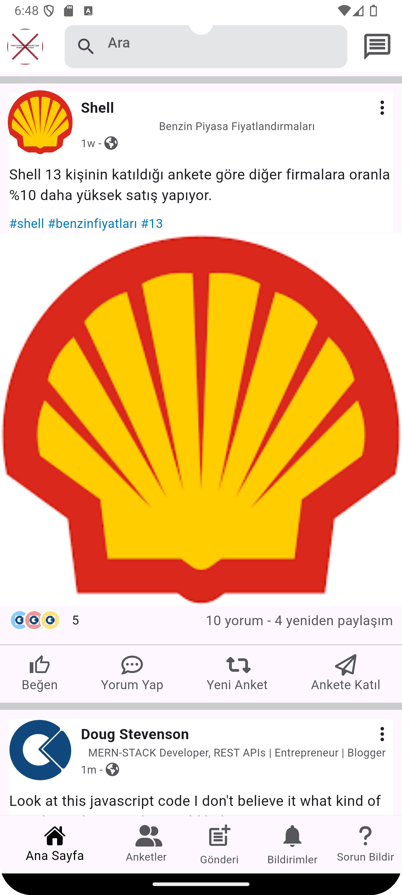</td>
    </tr>
    <tr>
      <td colspan="4">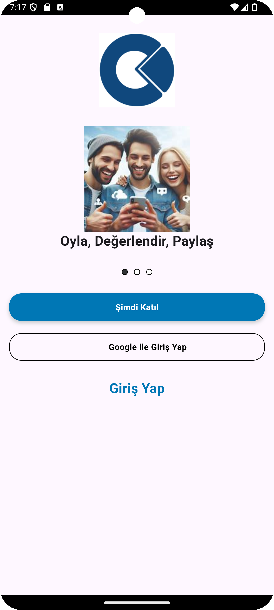</td>
    </tr>
      <tr>
      <td colspan="4">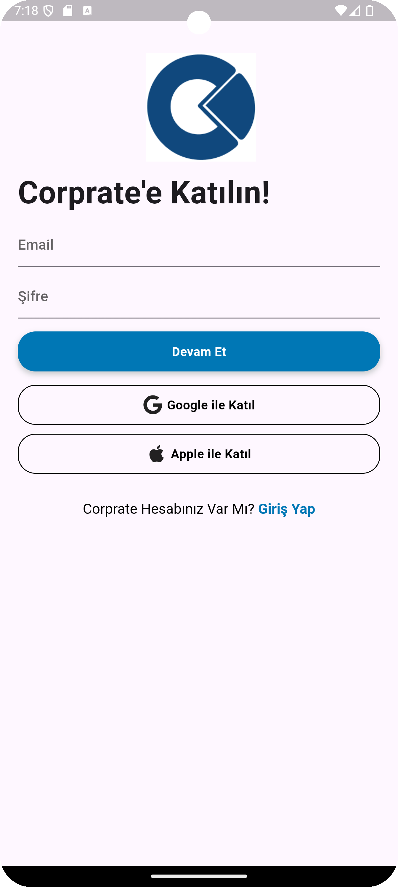</td>
    </tr>
  </table>
  
  

  

    
<h3>Sprint 2 Jira Screenshots</h3>

    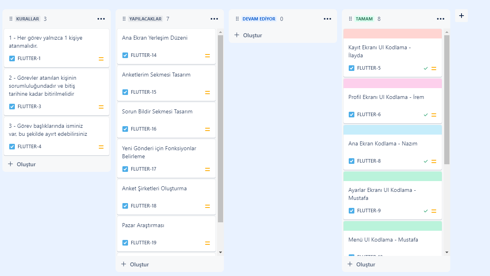
    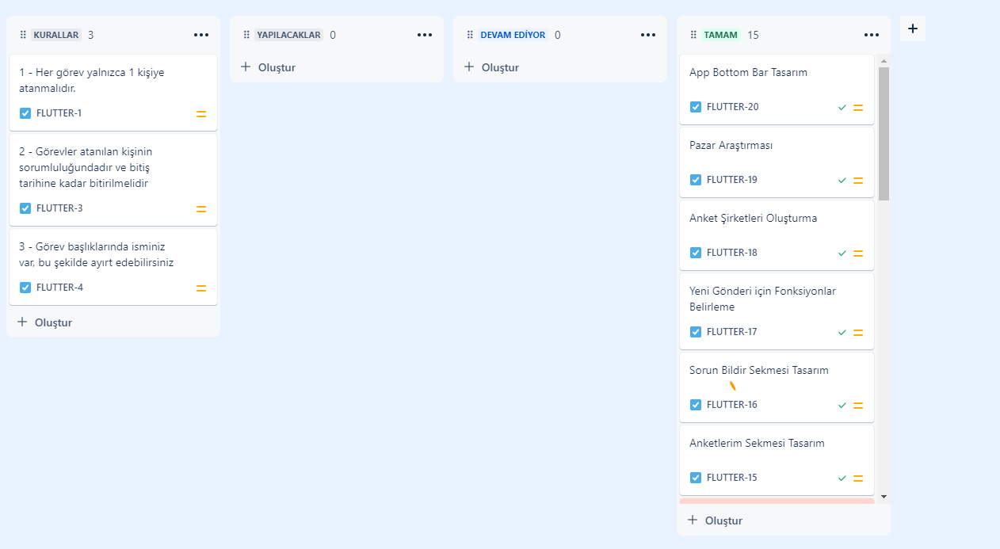
  

  

    
<h3>Sprint 2 Figma Screenshots</h3>

    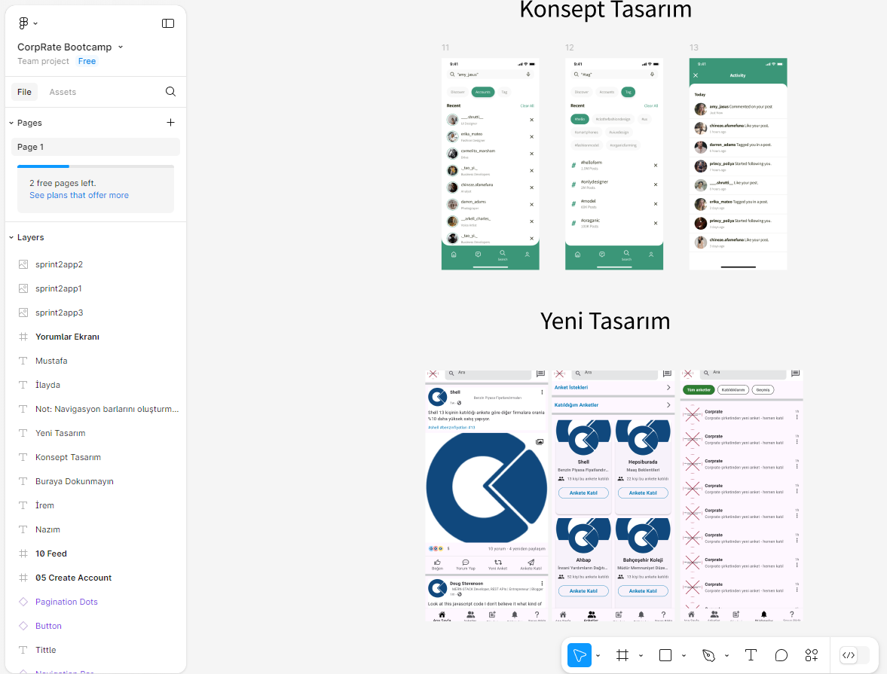
  

  

    
<h3>Sprint 2 Burndown Chart</h3>

    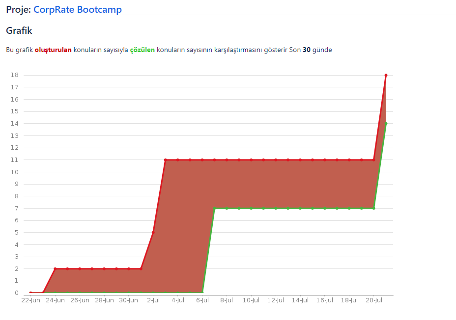
  

  

    
<h3>Sprint 2 Daily Scrum Screenshots</h3>

    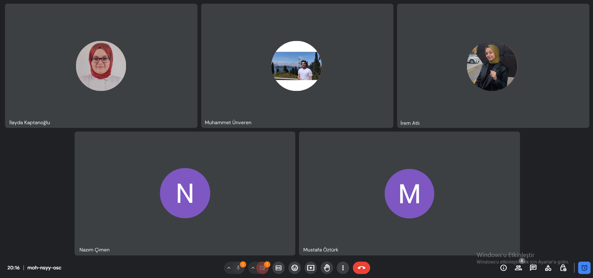
    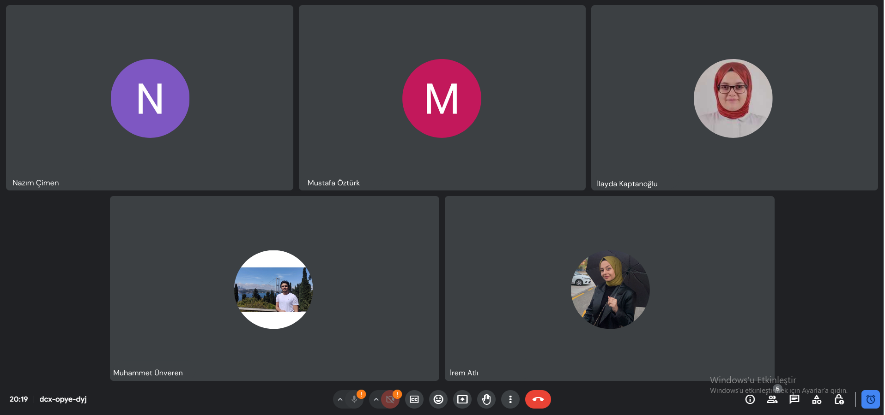
  

**Sprint Notları**:

    - Uygulamada kulanıcıların açılan anketlere katılabilmesi için arayüz oluşturuldu
    
    - Ana ekran yeniden düzenlendi ve akış oluşturuldu
    
    - Firebase bağlantıları için hazırlık yapıldı
    
    - Uygulama giriş ekranları yeniden düzenlendi
    
    - App bar üzerine 4 ana sekme eklendi
    
    - Bildirim sistemi hazırlandı
    
  - **Sprint için Belirlenen Toplam Puan**: 120 puan (1. Sprint için belirlenen puan 120)
  - **Toplam Tamamlanan Puan**: `(240 puan tamamlandı)`
  - **Puan Tamamlama Mantığı**: Her iki Sprint için 4 tasarım 4 kod olmak üzere 8 görev belirlendi. Zorluk düzeyleri her üye için eşit ayarlandığı için her bir görev 15 puan sayıldı. 
  
  - **Sprint Review:**
    - İkinci Sprint için ağırlıklı olarak uygulama mimarisine çalıştık
    - Ekipte kod yazma görevini Mustafa İsmail Öztürk ve İrem Atlı üstlendi
    - Muhamet Ünveren kendi isteğiyle ekipten ayrıldı
    - Uygulamanın anket yanıtlama sistemi için hazırlıklara başlandı
  
  - **Sprint Retrospective:**
    - Bu sprint içinde iletişim anlamında kendimizi geliştirmemiz gerektiğini gördük
    - Hızlanmak amacıyla tüm kod yazma işlemlerini iki kişinin üstlenmesine kara verdik
    - Ekip içinde iyi düzeyde uyumu yakaladık
    - Önümüzdeki sprint için veritabanı işlemlerini tamamlamamız gerekiyor
 

  

